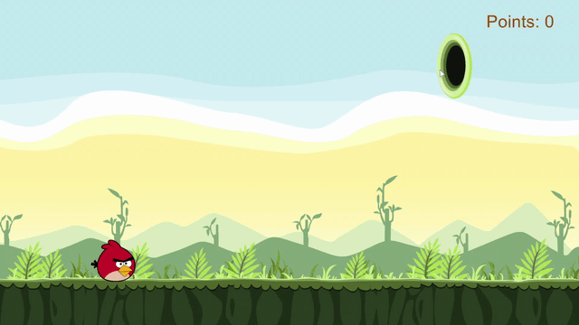

# Overview

[](LICENSE)
[](docs/README.md)



Happy Birds is a single-player action game where the player attempts to
launch their bird into a portal using their mouse. See [rules](#Rules).

## Build Requirements
1. 64-bit Microsoft Windows
2. Visual Studio 2015 Common Tools
3. [Cinder](https://libcinder.org/)
4. [CMake](https://cmake.org/)
5. [Choreograph](https://github.com/sansumbrella/Choreograph/tree/master/src/choreograph)

## Installation
1. If you don't have Visual Studio 2015, [install Visual Studio 2015](https://my.visualstudio.com/Downloads?q=visual%20studio%202015&wt.mc_id=o%7Emsft%7Evscom%7Eolder-downloads).
    1. Cinder v0.9.2 was built with Visual Studio 2015 in mind, so if you
    have a more recent build, uninstall it by navigating to Control Panel >
    Programs > Programs and Features > Uninstall a Program.
    2. Then, download Visual Studio Community 2015 with Update 3 for x64.
    3. Run the installer and, if prompted, select Modify and only select
    Common Tools for Visual C++ 2015.
    4. When the installation is complete, there is no need to click Launch.
    Go back to CLion and make the default toolchain a Visual Studio
    environment that points to C:\Program Files(x86)\Microsoft Visual
    Studio 14.0. Confirm that there are no warnings.
2. If you don't have Cinder, [download it](https://libcinder.org/download).
3. Install the [Choreograph](https://github.com/sansumbrella/Choreograph/tree/master/src/choreograph) library.
4. Clone this repository using 
```git clone https://github.com/CS126SP20/final-project-rrshen.git```
5. Build and run the project from Visual Studio.

## Documentation
This codebase (tries to) follow the [Google C++ Style Guide](https://google.github.io/styleguide/cppguide.html)
with Doxygen-style documentation. You can generate your own HTML version of the documentation.
See [the guide on the Doxygen page](http://www.doxygen.nl/manual/doxygen_usage.html).

## Rules
In each level, your bird will begin in the same position, to
the left of a portal in a randomized location. Using a mouse click,
your goal is to get your bird close enough to the portal that it
is sucked inside and passes the level.

You get a single click per level and may pause or restart the level
as you wish. The game ends the first time you miss the portal, and
your score displays as the number of levels you passed.

## Controls
| Key       | Action                                                      |
|---------- |-------------------------------------------------------------|
| `r`       | Restarts the level                                          |
| `p`       | Pauses the game                                             |
| `q`       | Quits the game                                              |
| `n`       | Restarts the game                                           |

Press any button to exit the starting screen. Your first mouse click in each
level approximately determines the trajectory of your bird.

##

**Author**: Rachel R Shen - [`rrshen2@illinois.edu`](mailto:rrshen2@illinois.edu)
